# 智能医生预约挂号系统 - Mermaid流程图文档

## 📋 文档概述

**文档目的**：集中展示系统中所有需要流程图的部分，使用Mermaid语法进行标准化渲染
**目标读者**：开发团队、架构师、项目经理、测试工程师
**版本历史**：v1.0 - 初始版本

## 🔄 系统架构流程图

### 系统整体架构图

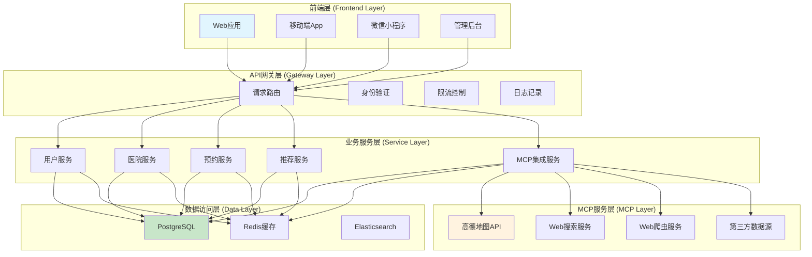
```mermaid
graph TB
    subgraph "前端层 (Frontend Layer)"
        A1[Web应用] 
        A2[移动端App]
        A3[微信小程序]
        A4[管理后台]
    end
    
    subgraph "API网关层 (Gateway Layer)"
        B1[请求路由]
        B2[身份验证]
        B3[限流控制]
        B4[日志记录]
    end
    
    subgraph "业务服务层 (Service Layer)"
        C1[用户服务]
        C2[医院服务]
        C3[预约服务]
        C4[推荐服务]
        C5[MCP集成服务]
    end
    
    subgraph "数据访问层 (Data Layer)"
        D1[PostgreSQL]
        D2[Redis缓存]
        D3[Elasticsearch]
    end
    
    subgraph "MCP服务层 (MCP Layer)"
        E1[高德地图API]
        E2[Web搜索服务]
        E3[Web爬虫服务]
        E4[第三方数据源]
    end
    
    A1 --> B1
    A2 --> B1
    A3 --> B1
    A4 --> B1
    
    B1 --> C1
    B1 --> C2
    B1 --> C3
    B1 --> C4
    B1 --> C5
    
    C1 --> D1
    C2 --> D1
    C3 --> D1
    C4 --> D1
    C5 --> D1
    
    C1 --> D2
    C2 --> D2
    C3 --> D2
    C4 --> D2
    C5 --> D2
    
    C5 --> E1
    C5 --> E2
    C5 --> E3
    C5 --> E4
    
    style A1 fill:#e1f5fe
    style E1 fill:#fff3e0
    style D1 fill:#c8e6c9
```

## 📊 核心业务流程流程图

### 用户注册与登录流程

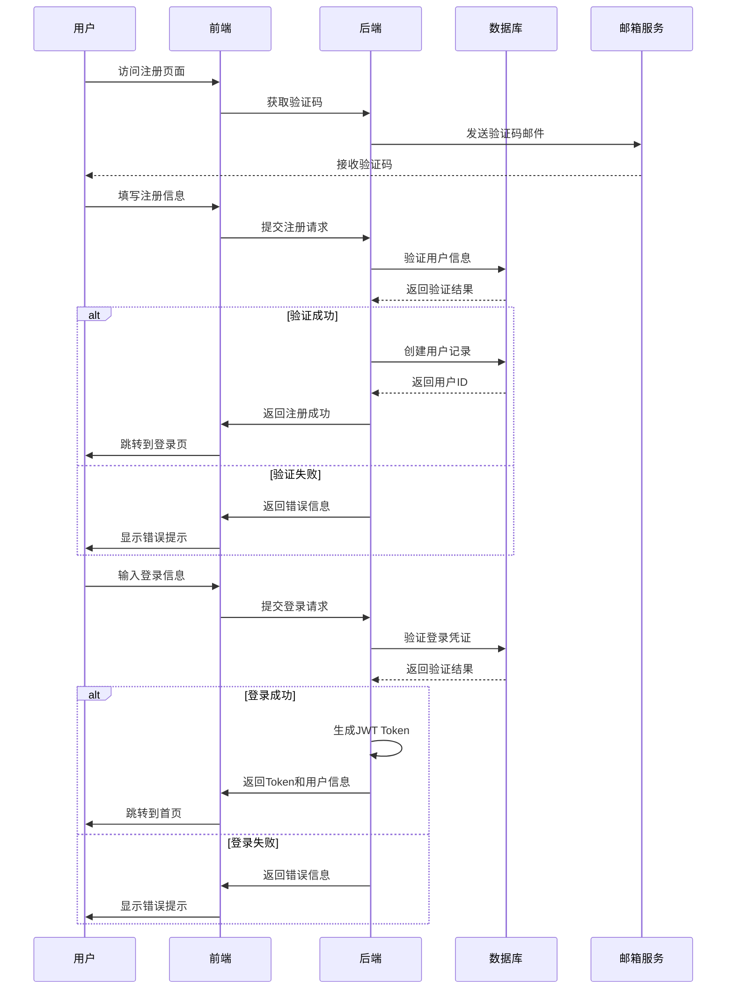
```mermaid
sequenceDiagram
    participant U as 用户
    participant F as 前端
    participant B as 后端
    participant D as 数据库
    participant E as 邮箱服务
    
    U->>F: 访问注册页面
    F->>B: 获取验证码
    B->>E: 发送验证码邮件
    E-->>U: 接收验证码
    
    U->>F: 填写注册信息
    F->>B: 提交注册请求
    B->>D: 验证用户信息
    D-->>B: 返回验证结果
    
    alt 验证成功
        B->>D: 创建用户记录
        D-->>B: 返回用户ID
        B->>F: 返回注册成功
        F->>U: 跳转到登录页
    else 验证失败
        B->>F: 返回错误信息
        F->>U: 显示错误提示
    end
    
    U->>F: 输入登录信息
    F->>B: 提交登录请求
    B->>D: 验证登录凭证
    D-->>B: 返回验证结果
    
    alt 登录成功
        B->>B: 生成JWT Token
        B->>F: 返回Token和用户信息
        F->>U: 跳转到首页
    else 登录失败
        B->>F: 返回错误信息
        F->>U: 显示错误提示
    end
```

### 医院发现与定位流程

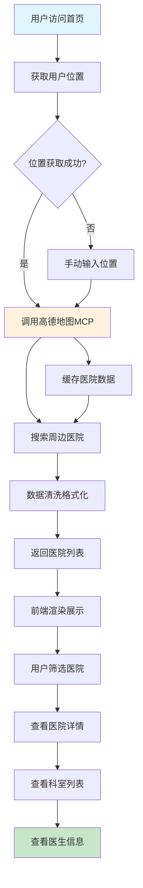
```mermaid
graph TD
    A[用户访问首页] --> B[获取用户位置]
    B --> C{位置获取成功?}
    C -->|是| D[调用高德地图MCP]
    C -->|否| E[手动输入位置]
    E --> D
    D --> F[搜索周边医院]
    F --> G[数据清洗格式化]
    G --> H[返回医院列表]
    H --> I[前端渲染展示]
    
    D --> J[缓存医院数据]
    J --> F
    
    I --> K[用户筛选医院]
    K --> L[查看医院详情]
    L --> M[查看科室列表]
    M --> N[查看医生信息]
    
    style A fill:#e1f5fe
    style N fill:#c8e6c9
    style D fill:#fff3e0
```

### 智能预约选择流程

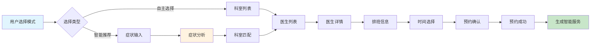
```mermaid
graph LR
    A[用户选择模式] --> B{选择类型}
    B -->|自主选择| C[科室列表]
    B -->|智能推荐| D[症状输入]
    
    C --> E[医生列表]
    D --> F[症状分析]
    F --> G[科室匹配]
    G --> E
    
    E --> H[医生详情]
    H --> I[排班信息]
    I --> J[时间选择]
    J --> K[预约确认]
    
    K --> L[预约成功]
    L --> M[生成智能服务]
    
    style A fill:#e1f5fe
    style M fill:#c8e6c9
    style F fill:#fff3e0
```

### 智能推荐算法流程

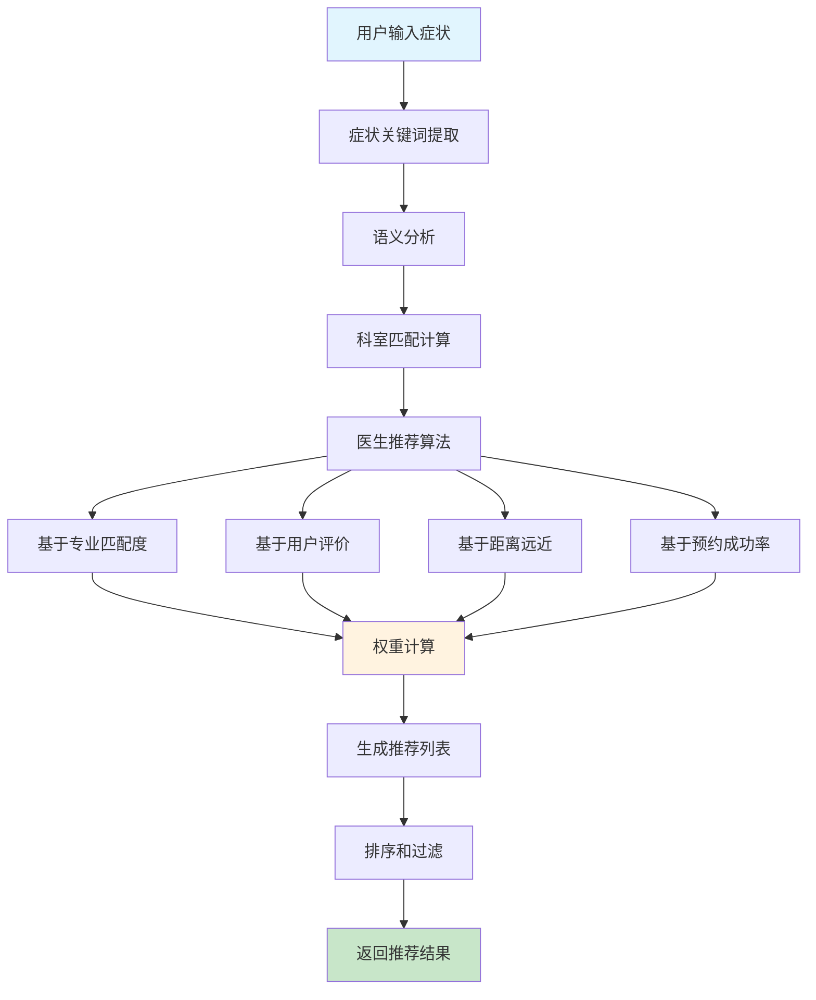
```mermaid
flowchart TD
    A[用户输入症状] --> B[症状关键词提取]
    B --> C[语义分析]
    C --> D[科室匹配计算]
    D --> E[医生推荐算法]
    
    E --> F[基于专业匹配度]
    E --> G[基于用户评价]
    E --> H[基于距离远近]
    E --> I[基于预约成功率]
    
    F --> J[权重计算]
    G --> J
    H --> J
    I --> J
    
    J --> K[生成推荐列表]
    K --> L[排序和过滤]
    L --> M[返回推荐结果]
    
    style A fill:#e1f5fe
    style M fill:#c8e6c9
    style J fill:#fff3e0
```

### 预约管理流程

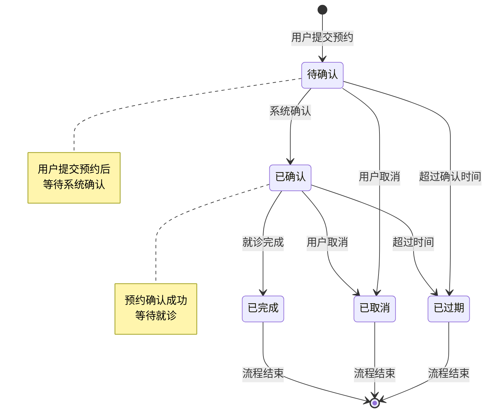
```mermaid
stateDiagram-v2
    [*] --> 待确认 : 用户提交预约
    待确认 --> 已确认 : 系统确认
    已确认 --> 已完成 : 就诊完成
    已确认 --> 已取消 : 用户取消
    已确认 --> 已过期 : 超过时间
    
    待确认 --> 已取消 : 用户取消
    待确认 --> 已过期 : 超过确认时间
    
    已完成 --> [*] : 流程结束
    已取消 --> [*] : 流程结束
    已过期 --> [*] : 流程结束
    
    note right of 待确认
        用户提交预约后
        等待系统确认
    end note
    
    note right of 已确认
        预约确认成功
        等待就诊
    end note
```

### MCP服务集成流程

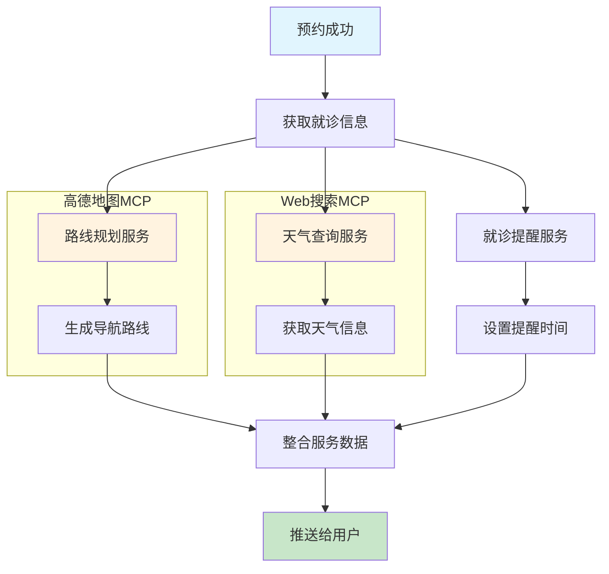
```mermaid
graph TB
    A[预约成功] --> B[获取就诊信息]
    B --> C[路线规划服务]
    B --> D[天气查询服务]
    B --> E[就诊提醒服务]
    
    C --> F[生成导航路线]
    D --> G[获取天气信息]
    E --> H[设置提醒时间]
    
    F --> I[整合服务数据]
    G --> I
    H --> I
    
    I --> J[推送给用户]
    
    subgraph "高德地图MCP"
        C
        F
    end
    
    subgraph "Web搜索MCP"
        D
        G
    end
    
    style A fill:#e1f5fe
    style J fill:#c8e6c9
    style C fill:#fff3e0
    style D fill:#fff3e0
```

### 数据同步与缓存流程

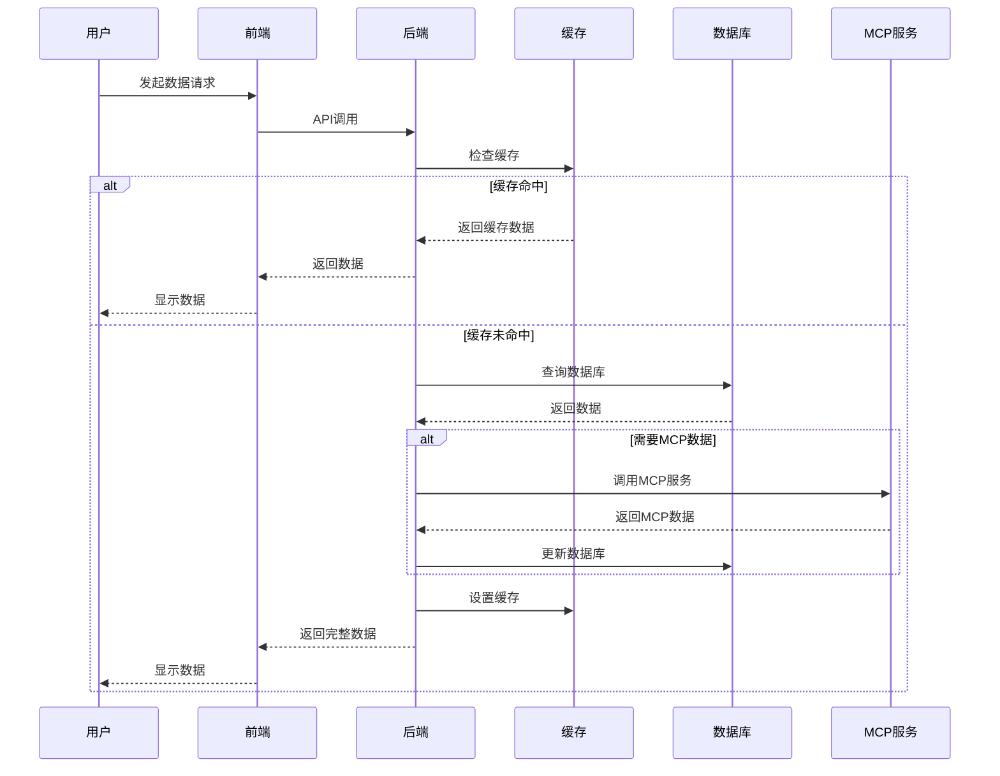
```mermaid
sequenceDiagram
    participant U as 用户
    participant F as 前端
    participant B as 后端
    participant C as 缓存
    participant D as 数据库
    participant M as MCP服务
    
    U->>F: 发起数据请求
    F->>B: API调用
    B->>C: 检查缓存
    
    alt 缓存命中
        C-->>B: 返回缓存数据
        B-->>F: 返回数据
        F-->>U: 显示数据
    else 缓存未命中
        B->>D: 查询数据库
        D-->>B: 返回数据
        
        alt 需要MCP数据
            B->>M: 调用MCP服务
            M-->>B: 返回MCP数据
            B->>D: 更新数据库
        end
        
        B->>C: 设置缓存
        B-->>F: 返回完整数据
        F-->>U: 显示数据
    end
```

### 错误处理与监控流程

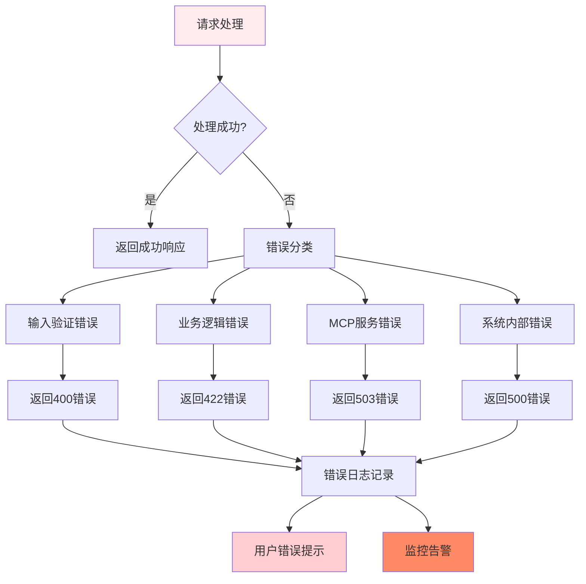
```mermaid
graph TD
    A[请求处理] --> B{处理成功?}
    B -->|是| C[返回成功响应]
    B -->|否| D[错误分类]
    
    D --> E[输入验证错误]
    D --> F[业务逻辑错误]
    D --> G[MCP服务错误]
    D --> H[系统内部错误]
    
    E --> I[返回400错误]
    F --> J[返回422错误]
    G --> K[返回503错误]
    H --> L[返回500错误]
    
    I --> M[错误日志记录]
    J --> M
    K --> M
    L --> M
    
    M --> N[用户错误提示]
    M --> O[监控告警]
    
    style A fill:#ffebee
    style N fill:#ffcdd2
    style O fill:#ff8a65
```

### 性能监控数据流

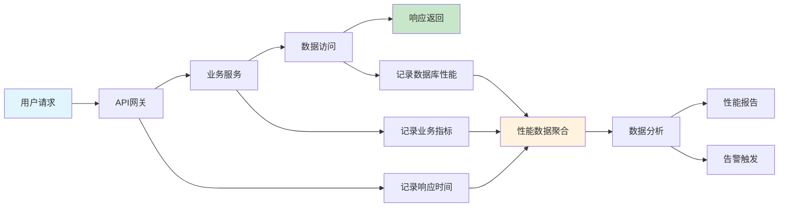
```mermaid
graph LR
    A[用户请求] --> B[API网关]
    B --> C[业务服务]
    C --> D[数据访问]
    D --> E[响应返回]
    
    B --> F[记录响应时间]
    C --> G[记录业务指标]
    D --> H[记录数据库性能]
    
    F --> I[性能数据聚合]
    G --> I
    H --> I
    
    I --> J[数据分析]
    J --> K[性能报告]
    J --> L[告警触发]
    
    style A fill:#e1f5fe
    style E fill:#c8e6c9
    style I fill:#fff3e0
```

## 🔧 开发与部署流程

### CI/CD持续集成流程

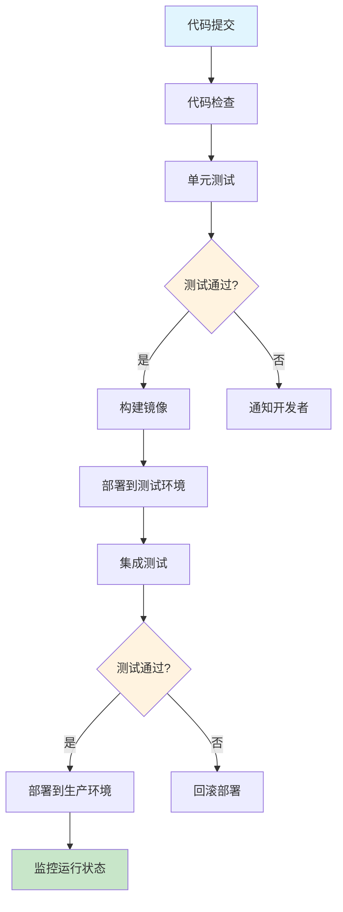
```mermaid
graph TB
    A[代码提交] --> B[代码检查]
    B --> C[单元测试]
    C --> D{测试通过?}
    
    D -->|是| E[构建镜像]
    D -->|否| F[通知开发者]
    
    E --> G[部署到测试环境]
    G --> H[集成测试]
    H --> I{测试通过?}
    
    I -->|是| J[部署到生产环境]
    I -->|否| K[回滚部署]
    
    J --> L[监控运行状态]
    
    style A fill:#e1f5fe
    style L fill:#c8e6c9
    style D fill:#fff3e0
    style I fill:#fff3e0
```

### 数据库迁移流程

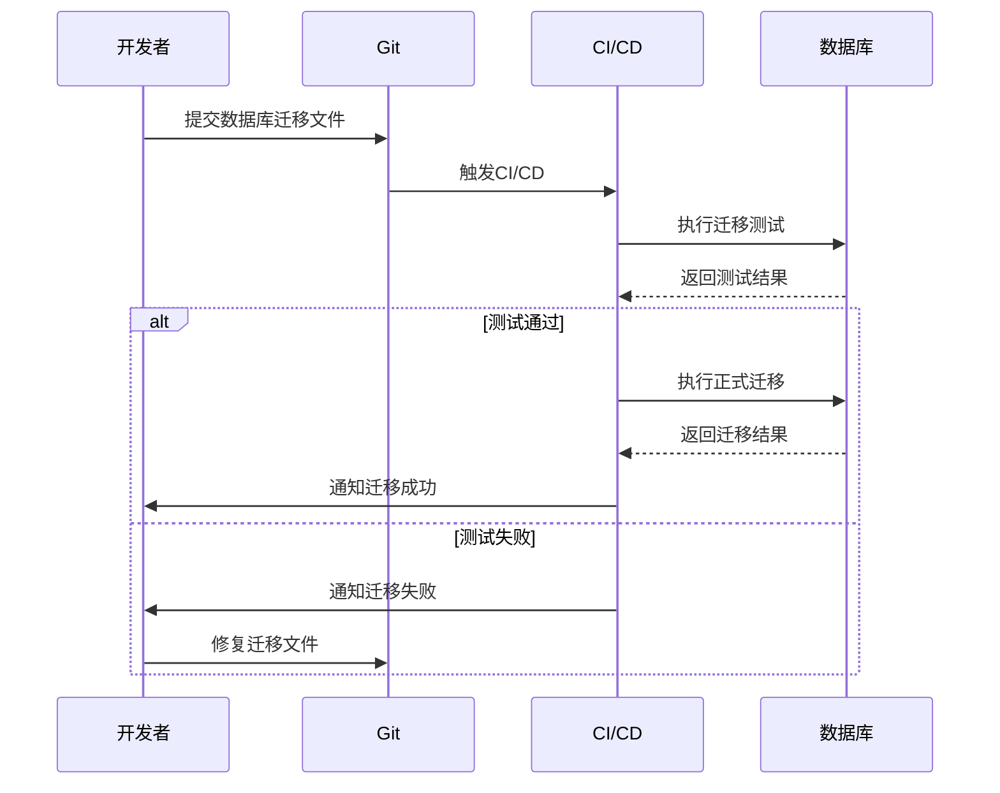
```mermaid
sequenceDiagram
    participant D as 开发者
    participant G as Git
    participant C as CI/CD
    participant DB as 数据库
    
    D->>G: 提交数据库迁移文件
    G->>C: 触发CI/CD
    C->>DB: 执行迁移测试
    DB-->>C: 返回测试结果
    
    alt 测试通过
        C->>DB: 执行正式迁移
        DB-->>C: 返回迁移结果
        C->>D: 通知迁移成功
    else 测试失败
        C->>D: 通知迁移失败
        D->>G: 修复迁移文件
    end
```

## 🎯 Agent协作流程图

### 项目开发协作流程

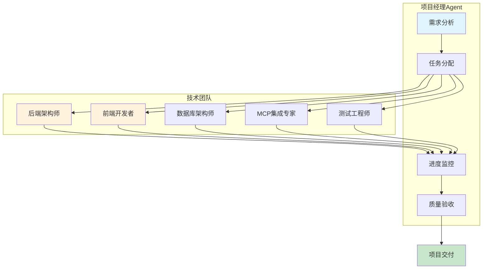
```mermaid
graph TB
    subgraph "项目经理Agent"
        A1[需求分析]
        A2[任务分配]
        A3[进度监控]
        A4[质量验收]
    end
    
    subgraph "技术团队"
        B1[后端架构师]
        B2[前端开发者]
        B3[数据库架构师]
        B4[MCP集成专家]
        B5[测试工程师]
    end
    
    A1 --> A2
    A2 --> B1
    A2 --> B2
    A2 --> B3
    A2 --> B4
    A2 --> B5
    
    B1 --> A3
    B2 --> A3
    B3 --> A3
    B4 --> A3
    B5 --> A3
    
    A3 --> A4
    A4 --> C[项目交付]
    
    style A1 fill:#e1f5fe
    style C fill:#c8e6c9
    style B1 fill:#fff3e0
    style B2 fill:#fff3e0
```

### 代码审查流程

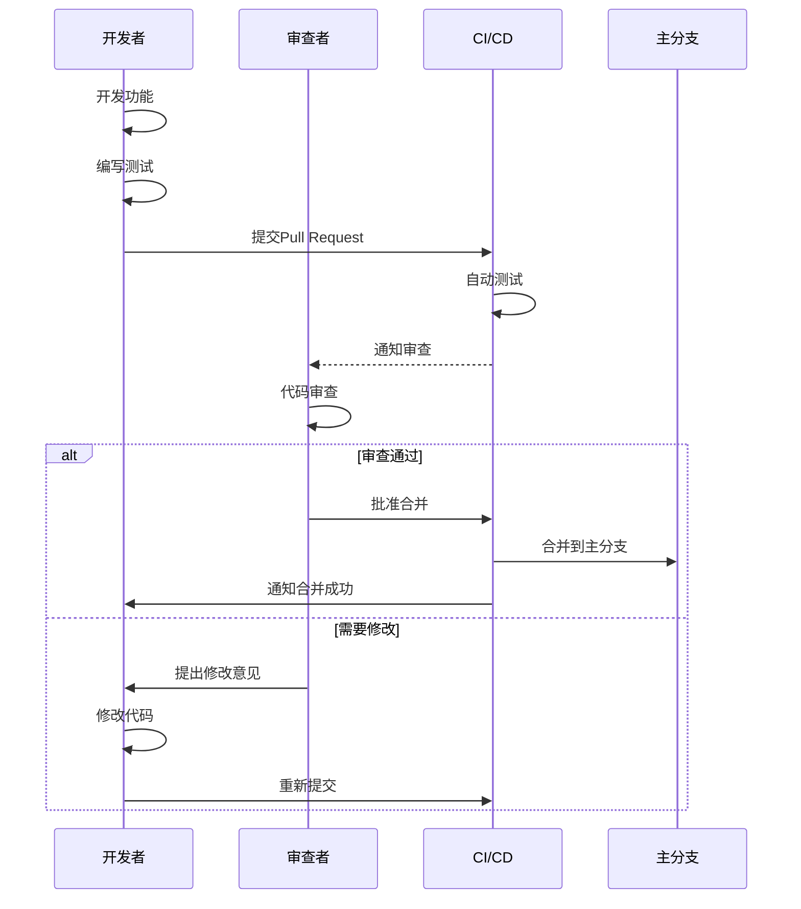
```mermaid
sequenceDiagram
    participant D as 开发者
    participant R as 审查者
    participant C as CI/CD
    participant M as 主分支
    
    D->>D: 开发功能
    D->>D: 编写测试
    D->>C: 提交Pull Request
    
    C->>C: 自动测试
    C-->>R: 通知审查
    
    R->>R: 代码审查
    
    alt 审查通过
        R->>C: 批准合并
        C->>M: 合并到主分支
        C->>D: 通知合并成功
    else 需要修改
        R->>D: 提出修改意见
        D->>D: 修改代码
        D->>C: 重新提交
    end
```

## 📈 系统扩展流程

### 水平扩展流程

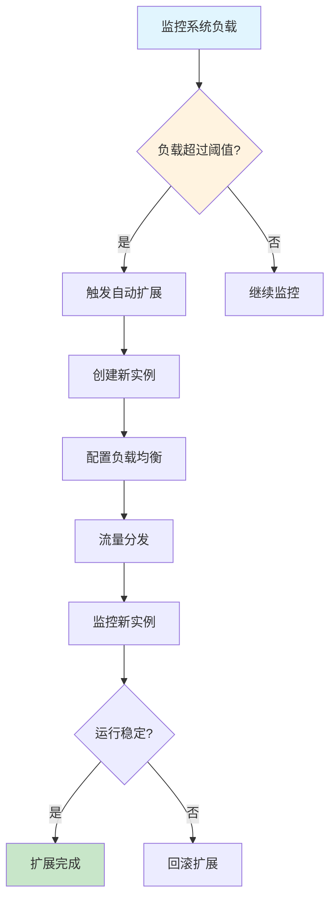
```mermaid
graph TD
    A[监控系统负载] --> B{负载超过阈值?}
    B -->|是| C[触发自动扩展]
    B -->|否| D[继续监控]
    
    C --> E[创建新实例]
    E --> F[配置负载均衡]
    F --> G[流量分发]
    G --> H[监控新实例]
    
    H --> I{运行稳定?}
    I -->|是| J[扩展完成]
    I -->|否| K[回滚扩展]
    
    style A fill:#e1f5fe
    style J fill:#c8e6c9
    style B fill:#fff3e0
```

## 🔍 完善建议与补充流程图

基于对现有文档的检查，我发现了以下可以完善的流程图部分：

### 补充流程图1：用户反馈处理流程

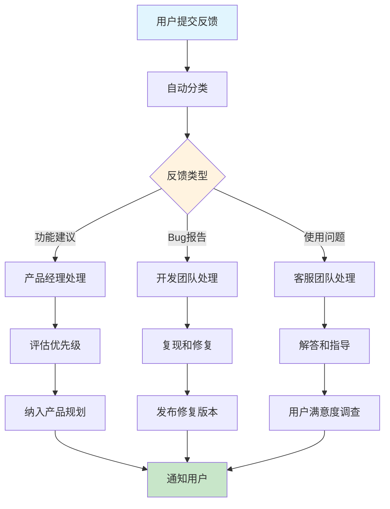
```mermaid
graph TD
    A[用户提交反馈] --> B[自动分类]
    B --> C{反馈类型}
    
    C -->|功能建议| D[产品经理处理]
    C -->|Bug报告| E[开发团队处理]
    C -->|使用问题| F[客服团队处理]
    
    D --> G[评估优先级]
    E --> H[复现和修复]
    F --> I[解答和指导]
    
    G --> J[纳入产品规划]
    H --> K[发布修复版本]
    I --> L[用户满意度调查]
    
    J --> M[通知用户]
    K --> M
    L --> M
    
    style A fill:#e1f5fe
    style M fill:#c8e6c9
    style C fill:#fff3e0
```

### 补充流程图2：数据备份与恢复流程

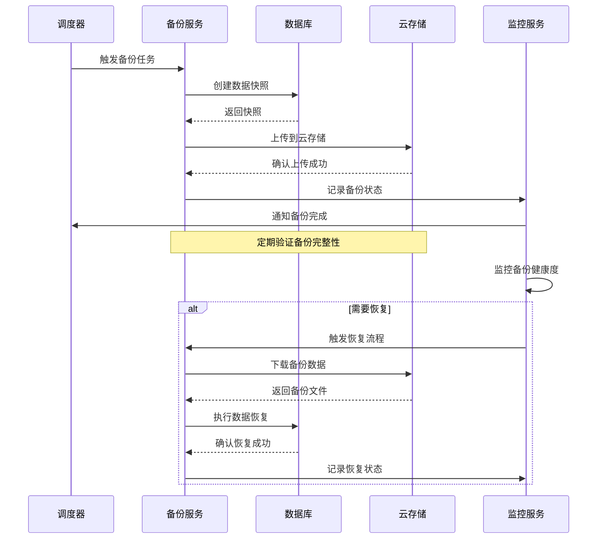
```mermaid
sequenceDiagram
    participant S as 调度器
    participant B as 备份服务
    participant D as 数据库
    participant C as 云存储
    participant M as 监控服务
    
    S->>B: 触发备份任务
    B->>D: 创建数据快照
    D-->>B: 返回快照
    B->>C: 上传到云存储
    C-->>B: 确认上传成功
    B->>M: 记录备份状态
    M->>S: 通知备份完成
    
    Note over B,C: 定期验证备份完整性
    
    M->>M: 监控备份健康度
    alt 需要恢复
        M->>B: 触发恢复流程
        B->>C: 下载备份数据
        C-->>B: 返回备份文件
        B->>D: 执行数据恢复
        D-->>B: 确认恢复成功
        B->>M: 记录恢复状态
    end
```

---

**文档版本**：v1.0  
**创建时间**：2024年  
**负责人**：项目经理Agent + 系统架构师Agent  
**下一步**：在开发过程中持续更新和完善流程图